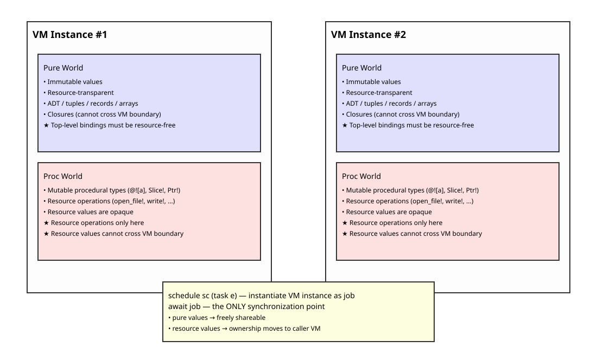

# [WIP] Proc System: A Separate World for Controlled Mutation

Phox separates *pure* and *procedural* worlds at the type and syntax level.

---

## Procedural types

Procedural types (`DynArray! a`, `Slice! a`, `Ptr! a`, …) represent *mutable* data structures used only inside procedural blocks.

- **cannot escape** into the pure world  
- pure functions **cannot observe** or depend on them  
- they exist only as *temporary mutable views* created via `thaw!`  
- they must be converted back to pure values via `freeze!`

Procedural types are always local to a single VM instance and never shared.

```phox
proc! {
    let buf = thaw!(xs);     // @[a] → DynArray a
    do_inplace_operation!(buf);
    freeze!(buf)             // DynArray a → @[a]
}
```

---

## User-defined procedures

**Define procedures**:
- Procedure name must end with `!`
- Procedures are **uncurried**
- `proc(args..) {...}` is **procedure abstraction**

```rust , ignore
*let foo! = proc(x) {...};
*let bar! = proc(x,y) {...};
*let download! = proc(url) {...};
```

**Procedure call** (only allowed inside `proc! { ... }`):
```rust , ignore
proc! {
  foo!(1);
  bar!(2,3);
  ()  // `proc! {...}` must return a **pure** value
};

let x = proc! { download!(url) };
```

---

## Resource types

Resource types represent *opaque handles* to external OS resources.

- **can escape** into the pure world  
- pure functions **cannot observe** or pattern-match them  
- operations on resource values are allowed **only in proc world**  
- each resource type defines a destructor `drop!`  
- `drop!` is called automatically when the reference count becomes zero  
- `drop!` cannot be called explicitly

Resource values may be shared within a single VM instance without mutual exclusion,  
because procedural types never escape and pure values are immutable.

> [!NOTE]
> Resource types are **builtin** and provided only by the runtime system.  
> Users **cannot** define new resource types.  
> ```phox
> // ----
> // The following `resource ... drop! ...` syntax is **illustrative only**
> // and does not exist in the actual language:
> // ----
> // Define resource type.
> // - Resource name must end with `!`
> // - Resource type has exactly one constructor of the same name
> // - Resource type has exactly one destructor `drop!`
> // - `drop!` is called automatically when Rc becomes 0
> // - Construction and pattern match are allowed only in proc world
> resource MyResource! a = @[a]
> drop! = proc(MyResource! xs) {
>   ...
> };
> ```


---

## Concurrency and VM instances

Each VM instance is a single-threaded execution context.

- procedural types never escape  
  → **no shared mutable state**  
- pure values are immutable  
  → **safe to share**  
- resource values are opaque  
  → **safe to share as long as operations are restricted to proc world  
    and isolated within VM boundaries**

**Only the `await` operation can transfer resource values between VM instances.**

This means:

- resource sharing/movement happens *only* at `await` boundaries  
- mutual exclusion is required *only* for resource operations that cross VM boundaries  
- no mutual exclusion is needed inside a single VM instance

If the job's return value does not contain a resource value,  
there is no limit on the number of waiters.  

Otherwise, Phox limits the number of waiters for a `JobHandle a` to `1` at most.  
In this case, `await job` consumes the resource returned by `job` (ownership
transfer), and any subsequent calls to `await job` will result in an error.

> [!NOTE]
> Resource operations may interact with external OS resources.  
> External resources are not pure and may cause race conditions.  
> Phox guarantees safety inside the VM, but external resource conflicts  
> must be handled by appropriate OS-level APIs (e.g., file locks).


---

## Opacity of Resources and Transparency of Resource Ownership

Resource-type values are opaque.  
However, resource ownership must be structurally visible and transparent.

To prevent resource leaks,  
Phox restricts the encapsulation of resource values within opaque structures.

Specifically:
- Closures cannot cross the VM boundary.
- Any values containing closures cannot cross the VM boundary.

Therefore, `await job` can return the following:
- ADTs, Arrays, tuples, or records that do not contain closures,
- Resource values, or
- Primitive values.

---

## Rules for Transparency of Resource Ownership

- Resource Inflow Violation Rules:
  - Values bound by top-level `let`/`let rec` must be *resource-free*
  - Values passed to a `task` constructor as its arguments must be *resource-free*.  
    These values will be bound to the initial environment of the corresponding job.
  - The initial environment of a job contains the task's arguments only.  
    (*resource-free* environment)
  - And job can access to the top-level/global environment.  
    (*resource-free* environment)

- Resource Outflow Violation Rules:
  - The return value of `await job` must be *resource-transparent*

- Resource Sourcing Violation Rule:
  - The return value of `proc!{...}` must be *resource-transparent*  
    **if such expressions exist in top-level `let`/`let rec` bindings**.


where:

- *resource-free* means
  : The value must not contain any resource values

- *resource-transparent* means
  : The value must not contain any opaque structures, such as closures  
    (This prevents resources from being hidden inside ADTs or closures.)

> [!NOTE]
> In other words,  
> - Top-level `let`/`let rec` bindings must be *resource-free*:  
>   their right-hand-side expressions (and all subexpressions) must not construct resource values.
> - A call to the `task` constructor must be *resource-free*.  
>   The expression passed as its argument (and all its sub-expressions) must not contain any resource values nor opaque structures.
> - The return value of `await job` (i.e. the resulting value of a `task`) must be *resource-transparent*.

---


---

## Open issues

> [!NOTE]
> **TODO**: Phox must detect and eliminate cases where top-level `let`/`let rec`
> bindings contain resource values **by recursively checking the AST**.
> 
> The below is the typical case:

```rust , ignore
// `r` is a resource value.
let r = proc!{ open_file!("foo.txt") };

// λ expression that captures resource `r`.
let f = \x. proc! { write!(r, x); };

// Note that value structure of type `MyADT a` is opaque for the type system.(!)
// ADT values can encapsulate closures. (resource `r` leaks!)
type MyADT a = MyADT (a -> ());
let v = MyADT f;
```


> [!NOTE]
> **T.B.D.**: Phox may restrict use of `proc! {...}` only for `*let` template definitions.  
> This can eliminate most miss-usecases like the above in the language syntax-level.


See also [Structural Transparency of Types (STraT)](./STraT.md).
